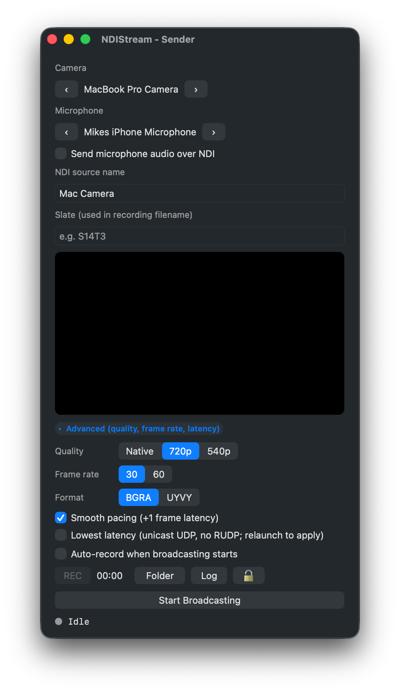

<p align="center">
  
</p>

<h1 align="center">NDIStream</h1>

<p align="center">
  <strong>Free, open-source NDI sender &amp; receiver for macOS.</strong><br />
  Broadcast a camera, view any NDI source, record both sides with audio. One window each. No bloat.
</p>

<p align="center">
  <a href="https://github.com/mikecerisano/NDIStream/releases/latest"></a>
  <a href="LICENSE"></a>
  
  
  <a href="https://github.com/mikecerisano/NDIStream/releases"></a>
</p>

<p align="center">
  
</p>

---

## Download

Grab the latest universal `.app` from **[Releases](https://github.com/mikecerisano/NDIStream/releases)**. Unzip, drag into Applications, and launch. Signed and notarized, so no right-click-Open dance.

## Why this exists

Every other Mac NDI tool is paid, locked inside NewTek's bloated NDI Tools suite, or both. NDIStream was built on a film set for a "fake Zoom" gag — lead actor's MacBook is the camera that ends up "in the call" via OBS, the off-camera scene partner sees the lead on a second Mac so she can act off her, NDI over a small GL.iNet travel router carries it. ~80–120ms glass-to-glass.

It's stayed small on purpose: one window for sending your camera, one window for receiving a source, and a record button on each. That's it.

## Features

- **Sender** — broadcast any built-in or USB camera as an NDI source.
  - Quality preset (Native / 720p / 540p), frame rate (30 / 60), smooth-pacing toggle.
  - UYVY pixel format end-to-end, async send — minimal CPU on Intel Macs.
  - Optional microphone capture muxed into the NDI audio channel.
- **Receiver** — discover any NDI source on the LAN and view it in a resizable, letterboxed window.
  - Audio passthrough from the source.
  - Tally pill, reconnecting status, full-screen auto-hide chrome.
- **Recording** — independent H.264 .mov per window with audio.
  - Sender records video + mic; Receiver records video + NDI audio.
  - Files land in `~/Movies/NDIStream/` with timestamped slate filenames. One tap to start, one to stop, no save dialogs.
  - Auto-record mode and lock UI for unattended set use.
- **Menu bar controls** for headless streaming.
- **Window menu** — both windows are independently openable/closeable.

## Requirements

- macOS 13 or later
- Apple Silicon or Intel (universal binary)
- [NDI SDK for Apple](https://ndi.video/) installed at `/Library/NDI SDK for Apple/` *(only required to build — the released `.app` bundles libndi.dylib)*
- [XcodeGen](https://github.com/yonaskolb/XcodeGen) (`brew install xcodegen`) — for project generation
- Xcode 15+

## Build

```bash
xcodegen generate
xcodebuild -project NDIStream.xcodeproj -scheme NDIStream -configuration Release \
    -destination 'generic/platform=macOS' ARCHS="x86_64 arm64" ONLY_ACTIVE_ARCH=NO build
```

Or open `NDIStream.xcodeproj` in Xcode and hit Run.

The built `.app` is a universal binary (x86_64 + arm64), ~30 MB. `libndi.dylib` is bundled into `Contents/Frameworks/` so the app runs on any Mac without the user installing the NDI SDK.

## Use

### Sender

1. Launch — Sender window opens by default.
2. Pick a camera, set NDI source name, toggle microphone if you want audio, hit **Start Broadcasting**.
3. Hit the red circle to start a recording; hit it again to stop. The folder icon opens `~/Movies/NDIStream/`.

### Receiver

1. **Window menu → NDIStream — Receiver** to open it.
2. Pick a discovered source from the dropdown, hit **Connect**.
3. Record button works the same way — records video and NDI audio.

## Notes

- Not sandboxed (NDI uses mDNS / UDP multicast and needs raw network access).
- Hardened runtime + library validation disabled so the bundled `libndi.dylib` loads.
- Microphone permission is requested on first broadcast with audio enabled.

## Looking for…

- **A free NewTek NDI Tools alternative for Mac?** This is it — Sender and Receiver in one ~30 MB app.
- **An NDI source for OBS, vMix, Resolume, TouchDesigner?** Run NDIStream's Sender, pick it up as an NDI source in your app.
- **A way to monitor an NDI feed on a second Mac?** That's the Receiver — discover and view any source on the network.

## License

[MIT](LICENSE).
